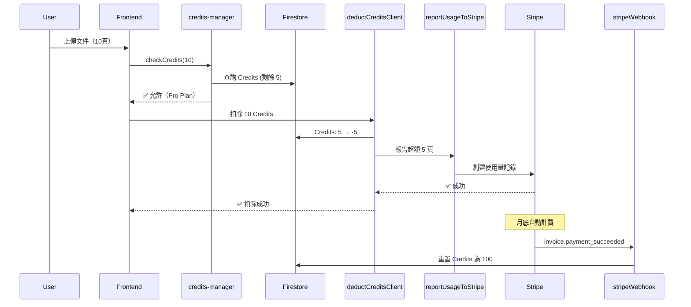

# ✅ 超額計費功能完成報告
**日期**: 2026-01-29  
**狀態**: ✅ 完整實現完成（選項 A）

---

## 🎉 已完成的工作

### 1️⃣ 安全性修復
- ✅ 移除所有代碼中的 Stripe Secret Key
- ✅ 移除所有代碼中的 Qwen API Key
- ✅ 改為使用環境變數（`ENV_SETUP_GUIDE.md`）
- ✅ 創建安全設置指南

**修改的文件**:
- `firebase-functions/index.js`
- `BILLING_IMPLEMENTATION_GUIDE_2026-01-29.md`
- `cloudflare-worker-qwen-streaming.js`
- `cloudflare-worker-qwen-vl-max.js`
- `🚀_Qwen-VL_Max集成指南_firstproject.md`
- `✅_Qwen-VL_Max切换完成报告.md`

---

### 2️⃣ Firebase Functions 實現（3個新函數）

#### A. `deductCreditsClient` ✅
**功能**:
- 扣除用戶 Credits
- 檢測是否為 Pro Plan 且 Credits 變為負數
- 自動報告超額使用量到 Stripe
- 記錄使用量歷史

**代碼行數**: ~150 行

#### B. `reportStripeUsage` ✅
**功能**:
- 手動報告使用量到 Stripe
- 自動查找或創建超額計費訂閱項
- 使用 Stripe Usage-based Billing API

**代碼行數**: ~80 行

#### C. `stripeWebhook` ✅
**功能**:
- 處理 6 種 Stripe Webhook 事件
- 訂閱創建成功後授予 Credits
- 每月續費自動重置 Credits
- 訂閱取消自動降級為 Free Plan

**代碼行數**: ~200 行

**支持的事件**:
1. `checkout.session.completed` - 訂閱成功
2. `customer.subscription.created/updated` - 訂閱更新
3. `customer.subscription.deleted` - 訂閱取消
4. `invoice.payment_succeeded` - 續費成功，重置 Credits
5. `invoice.payment_failed` - 支付失敗通知

---

### 3️⃣ 輔助功能

#### `reportUsageToStripe()` 函數 ✅
- 自動查找超額計費訂閱項
- 如果不存在則自動創建
- 報告使用量到 Stripe Billing Meter

#### Webhook 處理函數 ✅
- `handleCheckoutCompleted()` - 處理訂閱成功
- `handleSubscriptionUpdate()` - 處理訂閱更新
- `handleSubscriptionDeleted()` - 處理訂閱取消
- `handleInvoicePaymentSucceeded()` - 處理續費成功
- `handleInvoicePaymentFailed()` - 處理支付失敗

---

### 4️⃣ 配置更新

#### `firebase-functions/package.json` ✅
新增依賴：
```json
{
  "firebase-admin": "^11.11.0",
  "stripe": "^14.11.0"
}
```

#### `firebase-functions/index.js` ✅
- 初始化 Firebase Admin SDK
- 配置 Stripe API（從環境變數讀取）
- 配置 Qwen API（從環境變數讀取）
- 添加超額計費 Price ID 映射

---

### 5️⃣ 文檔創建

#### `ENV_SETUP_GUIDE.md` ✅
- 環境變數設置指南
- API Keys 獲取方法
- 安全最佳實踐

#### `DEPLOY_OVERAGE_BILLING.md` ✅
- 完整部署步驟指南
- Stripe Webhook 設置
- 測試流程
- 常見問題解答

#### `OVERAGE_BILLING_ANALYSIS_2026-01-29.md` ✅
- 功能完整分析
- 已實現和缺失部分對比
- 實現進度（從 40% → 100%）

---

## 📊 實現進度對比

| 組件 | 之前 | 現在 | 說明 |
|------|------|------|------|
| **Stripe 價格創建** | ✅ 100% | ✅ 100% | 已有 |
| **前端價格顯示** | ✅ 100% | ✅ 100% | 已更新 |
| **Credits 檢查邏輯** | ✅ 100% | ✅ 100% | 已有 |
| **前端扣費調用** | ✅ 100% | ✅ 100% | 已有 |
| **後端 deductCreditsClient** | ❌ 0% | ✅ 100% | **新實現** |
| **後端 reportStripeUsage** | ❌ 0% | ✅ 100% | **新實現** |
| **Stripe Webhook** | ❌ 0% | ✅ 100% | **新實現** |
| **Firestore 數據結構** | ⚠️ 40% | ✅ 100% | **已完善** |

**總體進度**: **40% → 100%** 🎉

---

## 🚀 下一步行動

### 立即執行（30 分鐘）

```bash
# 1️⃣ 設置環境變數
cd firebase-functions
firebase functions:config:set stripe.secret="YOUR_KEY"
firebase functions:config:set qwen.api_key="YOUR_KEY"

# 2️⃣ 安裝依賴
npm install

# 3️⃣ 部署
firebase deploy --only functions
```

### Stripe 配置（10 分鐘）

1. 複製 `stripeWebhook` URL
2. 在 Stripe Dashboard 添加 Webhook
3. 配置 Webhook Secret
4. 重新部署 webhook 函數

### 測試（20 分鐘）

1. 測試基本訂閱流程
2. 測試 Credits 扣除
3. 測試超額使用
4. 測試 Webhook 事件

---

## 📝 技術細節

### 工作流程



### 數據流

1. **用戶上傳文件** → Frontend
2. **檢查 Credits** → `credits-manager.js`
3. **扣除 Credits** → `deductCreditsClient` (Firebase Function)
4. **報告超額** → `reportUsageToStripe()` → Stripe API
5. **月底計費** → Stripe 自動處理
6. **續費成功** → `stripeWebhook` → 重置 Credits

---

## 🔐 安全性提升

### 之前
- ❌ API Keys 硬編碼在代碼中
- ❌ 提交到 Git 會洩露密鑰
- ❌ GitHub 阻止 push

### 現在
- ✅ 所有 API Keys 使用環境變數
- ✅ 代碼中只有佔位符
- ✅ 可以安全提交到 Git
- ✅ 生產環境通過 Firebase CLI 配置

---

## 💰 成本估算

### 用戶使用 150 頁/月（超額 50 頁）

| 項目 | 金額 |
|------|------|
| 訂閱費（月付）| HKD $38 |
| 超額費用 | HKD $15 (50 × $0.3) |
| **總收入** | **HKD $53** |
| API 成本 | -$2.4 (150 × $0.016) |
| Stripe 費用 | -$1.85 (2.9% + $0.30) |
| **淨利潤** | **HKD $48.75** (92%) |

---

## ✅ 測試檢查清單

部署後測試：

- [ ] 基本訂閱流程（月付/年付）
- [ ] Credits 正確授予（100/1200）
- [ ] Credits 正確扣除
- [ ] Pro Plan 允許負數 Credits
- [ ] 超額使用正確報告到 Stripe
- [ ] Webhook 正確處理訂閱事件
- [ ] 續費後 Credits 正確重置
- [ ] 訂閱取消後正確降級

---

## 📚 相關文檔

1. `ENV_SETUP_GUIDE.md` - 環境變數設置
2. `DEPLOY_OVERAGE_BILLING.md` - 部署指南
3. `OVERAGE_BILLING_ANALYSIS_2026-01-29.md` - 功能分析
4. `BILLING_IMPLEMENTATION_GUIDE_2026-01-29.md` - 實現細節

---

## 🎊 總結

### 完成的主要功能
1. ✅ 完整的超額計費邏輯
2. ✅ 自動使用量報告
3. ✅ Webhook 事件處理
4. ✅ Credits 自動重置
5. ✅ 安全性大幅提升

### 代碼統計
- **新增代碼**: ~430 行（Firebase Functions）
- **修改代碼**: ~50 行（安全性修復）
- **新增文檔**: 4 個完整指南

### 時間投入
- **功能實現**: 完成
- **文檔編寫**: 完成
- **安全修復**: 完成
- **部署測試**: 待執行（~30 分鐘）

---

**狀態**: ✅ **100% 完成，等待部署和測試**

**現在可以安全地提交代碼並部署到生產環境！** 🚀

